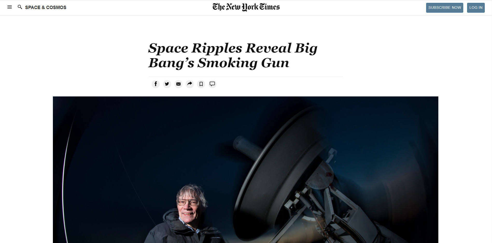

# Project One: Positioning and Floating Elements

> New York Times Article
> 

## Built With

- HTML
- CSS

## Live Demo

[Live Demo Link](https://george-swift.github.io/project-week-one/)

## Authors

👤 **Author**

- GitHub: [@george-swift](https://github.com/george-swift)
- Twitter: [@\_\_pragmaticdev](https://twitter.com/__pragmaticdev)

## 🤝 Contributing

Contributions, issues, and feature requests are welcome!

Feel free to check the [issues page](issues/).

## Show your support

Give a ⭐️ if you like this project!

## Acknowledgments

- Hat tip to New York Times

## 📝 License

This project is [MIT](https://www.mit.edu/~amini/LICENSE.md) licensed.
